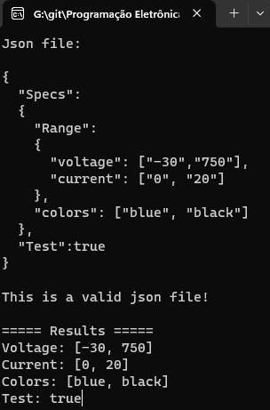

# JSMN [FORK] - Lightweight json parser in C

This is a forked repo from https://github.com/zserge/jsmn. Most part of the code remains the same as proposed by [@zerge](https://github.com/zserge). However, this fork is focused on make it easier to use in C programs, by implementing it not in a single header, and creating some helper functions.

## Usage

There is a README in the original repo explaining how to use this library. I've made a new example of how to use it, with a visualStudio C console application in the [example folder](./example/SimpleJsonExample/). This example focus on get real data from 3 samples of json files, changing the order of fields, and still getting the right data:

[](./example/SimpleJsonExample/)

# README infos from the [original repo](https://github.com/zserge/jsmn):

Philosophy
----------

Most JSON parsers offer you a bunch of functions to load JSON data, parse it
and extract any value by its name. jsmn proves that checking the correctness of
every JSON packet or allocating temporary objects to store parsed JSON fields
often is an overkill. 

JSON format itself is extremely simple, so why should we complicate it?

jsmn is designed to be	**robust** (it should work fine even with erroneous
data), **fast** (it should parse data on the fly), **portable** (no superfluous
dependencies or non-standard C extensions). And of course, **simplicity** is a
key feature - simple code style, simple algorithm, simple integration into
other projects.

Features
--------

* compatible with C89
* no dependencies (even libc!)
* highly portable (tested on x86/amd64, ARM, AVR)
* extremely small code footprint
* API contains only 2 functions
* no dynamic memory allocation
* incremental single-pass parsing
* library code is covered with unit-tests

Design
------

The rudimentary jsmn object is a **token**. Let's consider a JSON string:

```json
'{ "name" : "Jack", "age" : 27 }'
```

It holds the following tokens:

* Object: `{ "name" : "Jack", "age" : 27}` (the whole object)
* Strings: `"name"`, `"Jack"`, `"age"` (keys and some values)
* Number: `27`

In jsmn, tokens do not hold any data, but point to token boundaries in JSON
string instead. In the example above jsmn will create tokens like: Object
[0..31], String [3..7], String [12..16], String [20..23], Number [27..29].

Every jsmn token has a type, which indicates the type of corresponding JSON
token. jsmn supports the following token types:

* Object - a container of key-value pairs, e.g.:
	`{ "foo":"bar", "x":0.3 }`
* Array - a sequence of values, e.g.:
	`[ 1, 2, 3 ]`
* String - a quoted sequence of chars, e.g.: `"foo"`
* Primitive - a number, a boolean (`true`, `false`) or `null`

Besides start/end positions, jsmn tokens for complex types (like arrays
or objects) also contain a number of child items, so you can easily follow
object hierarchy.

This approach provides enough information for parsing any JSON data and makes
it possible to use zero-copy techniques.

Usage
-----

```c
#include "jsmn.h"

...
jsmn_parser p;
jsmntok_t t[128]; /* We expect no more than 128 JSON tokens */

jsmn_init(&p);
r = jsmn_parse(&p, s, strlen(s), t, 128); // "s" is the char array holding the json content
```

API
---

Token types are described by `jsmntype_t`:

```c
	typedef enum {
		JSMN_UNDEFINED = 0,
		JSMN_OBJECT = 1 << 0,
		JSMN_ARRAY = 1 << 1,
		JSMN_STRING = 1 << 2,
		JSMN_PRIMITIVE = 1 << 3
	} jsmntype_t;
```

**Note:** Unlike JSON data types, primitive tokens are not divided into
numbers, booleans and null, because one can easily tell the type using the
first character:

* <code>'t', 'f'</code> - boolean 
* <code>'n'</code> - null
* <code>'-', '0'..'9'</code> - number

Token is an object of `jsmntok_t` type:

```c
	typedef struct {
		jsmntype_t type; // Token type
		int start;       // Token start position
		int end;         // Token end position
		int size;        // Number of child (nested) tokens
	} jsmntok_t;
```

**Note:** string tokens point to the first character after
the opening quote and the previous symbol before final quote. This was made 
to simplify string extraction from JSON data.

All job is done by `jsmn_parser` object. You can initialize a new parser using:

```c
	jsmn_parser parser;
	jsmntok_t tokens[10];

	jsmn_init(&parser);

	// js - pointer to JSON string
	// tokens - an array of tokens available
	// 10 - number of tokens available
	jsmn_parse(&parser, js, strlen(js), tokens, 10);
```

This will create a parser, and then it tries to parse up to 10 JSON tokens from
the `js` string.

A non-negative return value of `jsmn_parse` is the number of tokens actually
used by the parser.
Passing NULL instead of the tokens array would not store parsing results, but
instead the function will return the number of tokens needed to parse the given
string. This can be useful if you don't know yet how many tokens to allocate.

If something goes wrong, you will get an error. Error will be one of these:

* `JSMN_ERROR_INVAL` - bad token, JSON string is corrupted
* `JSMN_ERROR_NOMEM` - not enough tokens, JSON string is too large
* `JSMN_ERROR_PART` - JSON string is too short, expecting more JSON data

If you get `JSMN_ERROR_NOMEM`, you can re-allocate more tokens and call
`jsmn_parse` once more.  If you read json data from the stream, you can
periodically call `jsmn_parse` and check if return value is `JSMN_ERROR_PART`.
You will get this error until you reach the end of JSON data.

Other info
----------

This software is distributed under [MIT license](http://www.opensource.org/licenses/mit-license.php),
 so feel free to integrate it in your commercial products.

- http://www.json.org/
- http://zserge.com/jsmn.html
